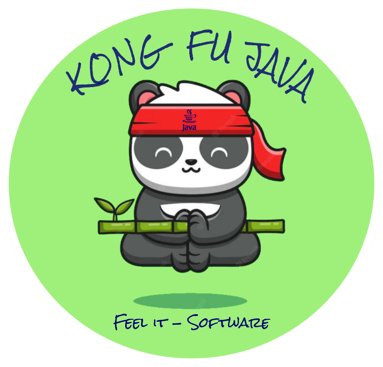

<h3 align="center">Android App</h3>
<h1 align="center">Welcome To Kong-Fu-Java!</h1>

## :information_source: About 

<h4 align="center">The "Kong Fu Java" project is a platform for learning a programming language for children.</h4> 

- The goal of the project is to develop an application for learning a programming language that opens the door to the world of development, which will include learning software accompanied by a guide specially developed for children between 9 to 14.
- The software language we chose to teach in the application is "JAVA". This basic language is one of the main skills today in software development.
- The requirements of the system are Android 9 operating system and above on a tablet device, a flexible system that supports changes, extensions, and is flexible for configuration adjustments. In addition, we put emphasis on the user interface and user experience to be interesting and easy to operate for the target audience.
- The tools used to build the Alpha version are the programming languages Kotlin and Jetpack Compose which were used in the Android Studio development environment. These languages contributed to the implementation of various features, for example, Drag and Drop. In addition, we used AI technology for reading text in the tutorial levels, Room Database, and datastore Preferences to save user data on the devices. Moreover, we used FireBase Authentication to implement user login and FireBase Real-Time Database to implement synchronization of the devices through the Cloud.
- The final product is divided into 2 types of users, a teacher/parent user type, and a child/student user type. For each user type, different screens are shown respectively. A parent/teacher user can register to the application, create a login code for child/student users and view real-time statistical data about their users. A child/student user can log in to the system using a login code given to him. In addition, the user can start the study program i.e. watch the tutorials and answer the practice program containing multi-choice and completion questions.
- In the final product, we aimed to create an app with high integration, fast and efficient use to achieve the goals of the system with maximum satisfaction of the users.

## :link: Menu:

- [Features](https://github.com/roma321m/Kong-Fu-Java#space_invader-features) 
- [Screen Gifs](https://github.com/roma321m/Kong-Fu-Java#iphone-screen-gifs) 
- [Future Plan](https://github.com/roma321m/Kong-Fu-Java#pencil-future-plan) 
- [Credits](https://github.com/roma321m/Kong-Fu-Java#pray-credits) 

## :space_invader: Features

- **Login and Sign-up** as parent or teacher user with any valid email
- Generating public code for child users
- **Login and Sign-up** as student user using a private/public code
- Choose your **profile picture**
- User progress tracking report
- A side menu containing a list of all users under the teacher or parent user
- A study program for children that includes instructional stages and a practice program that includes a variety of questions
- AI technology of panda character for reading text in the tutorial levels 
  

## :iphone: Screen Gifs
- [Login and Sign Up](https://github.com/roma321m/Kong-Fu-Java#pencil2-Login-and-Sign-Up) 
- [Teacher/Parent User](https://github.com/roma321m/Kong-Fu-Java#information_desk_person-Teacher-Parent-User) 
- [Child User](https://github.com/roma321m/Kong-Fu-Java#mortar_board-Child-User) 

 

### :pencil2: Login and Sign Up
|Child Login With Teahcer Code Screen|
|--|
|

|Parent Register, LogOut, Login, Errors Screen|
|--|
|

|Teacher Register, LogOut, Login, Profile IMG, Code Generation Screen|
|--|
|

 

### :information_desk_person: Teacher Parent User

|Supervisor Child Stats Screen|
|--|
|

 

### :mortar_board: Child User

|Child Menu, Music, About, LogOut, Private Login Screen|
|--|
|

|Tutorials Levels Screen|
|--|
|

|Multi Choice Screen|
|--|
|

|Drag and Drop Screen|
|--|
|

 
 

## :pencil: Future Plan 
- Add more worlds and levels
- Add option to learn more languages

## :pray: Credits
 create Logo Icon with https://create.vista.com/home/  
 create Gif with https://giphy.com/

